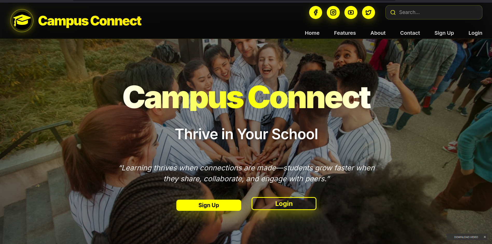
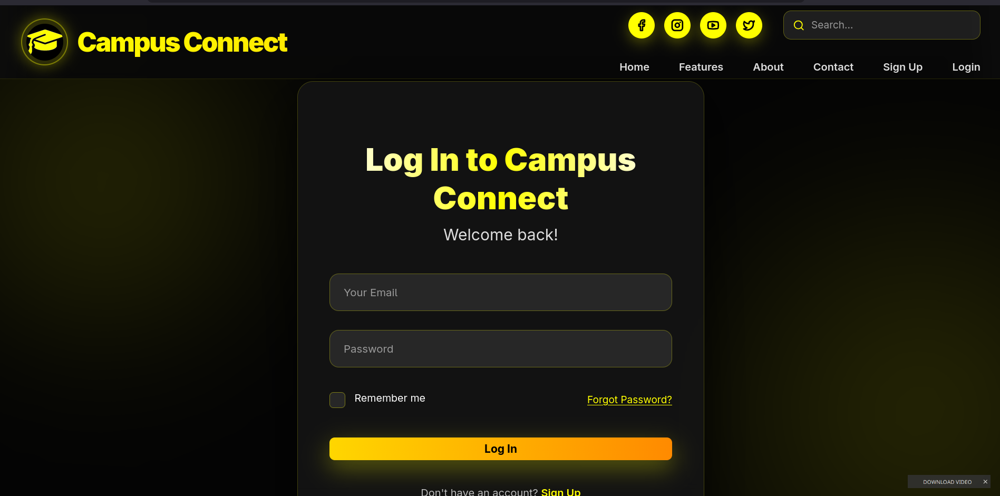
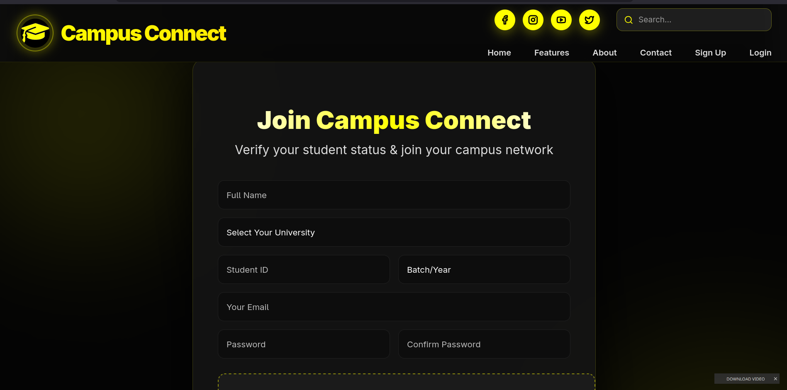
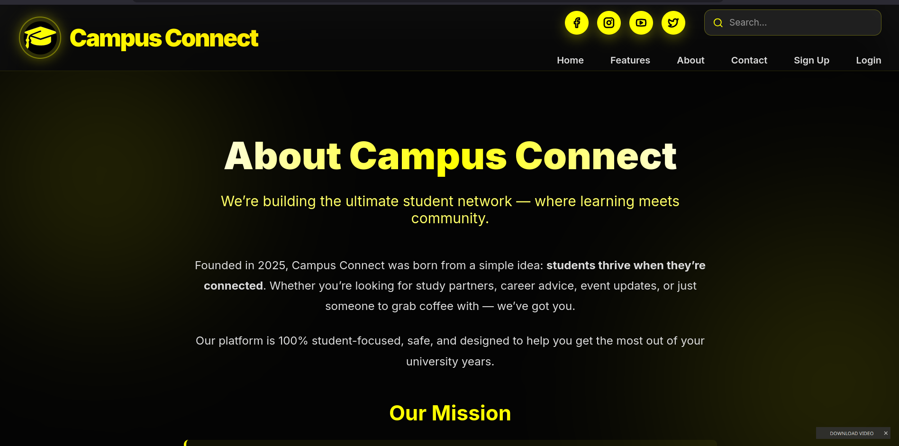
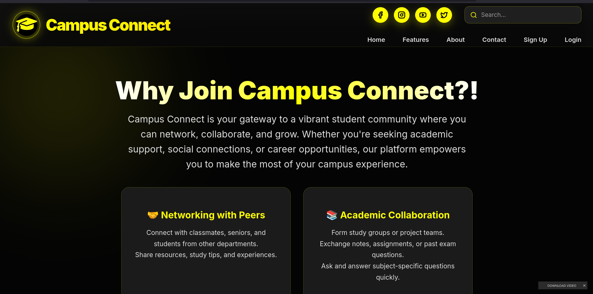

# 🎓 CampusConnect

CampusConnect is a modern web platform designed to enhance student life by connecting individuals within a campus environment. It provides a centralized space for students to explore features, interact, and access essential campus-related services through a clean and user-friendly interface.

---

## 🚀 Overview

CampusConnect aims to simplify communication and engagement within a campus by offering:

- A structured and intuitive user interface  
- Easy navigation across key sections (Home, About, Features, Authentication)  
- A scalable foundation for future expansion (social features, messaging, events, etc.)  

This project demonstrates full-stack development skills, combining frontend design, backend logic, and database integration.

---

## ✨ Features

- 🔐 User Authentication (Login & Signup)  
- 🏠 Clean and modern homepage UI  
- 📄 Informative About section  
- ⚙️ Features overview page  
- 🎨 Responsive and structured frontend  
- 🗄️ Backend + Database integration  

---

## 📸 Screenshots

### 🏠 Home Page

### 🔐 Login Page

### 📝 Signup Page

### ℹ️ About Page

### ⚙️ Features Page

---

## 🛠️ Tech Stack

**Frontend:**  
- React    

**Backend:**  
- Node.js
- Express js 

**Database:**  
- MongoDB

---

